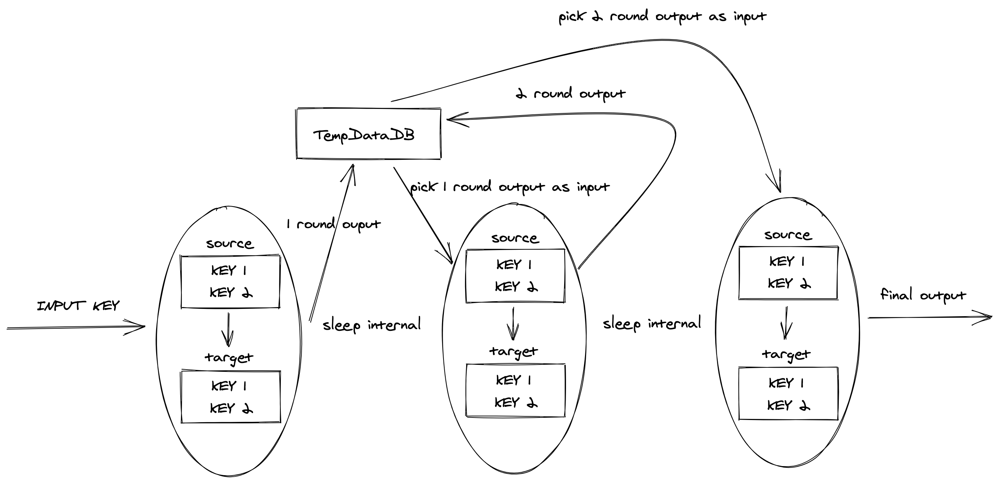

# cache-check 

缓存键值比较工具，目前支持Redis和Memcache。

## 背景

单元化进程中，需要对两个缓存集群进行数据双向复制。此时需要一个手段来检查、评估两个集群的数据一致性情况。对于已有的开源组件，我调研过阿里巴巴开源的[RedisFullCheck](https://github.com/alibaba/RedisFullCheck)，存在以下问题：

1. 不支持Memcache。
2. 没有考虑指令写入顺序问题（比如redis的hash结构的比较）。
3. Golang技术栈，扩展成本比较高。

## 基本原理

### 输入

对于Redis来说，我们可以通过`scan`遍历所有key，但是对于memcache等缓存来说，并没有提供遍历所有key的方式。对于这种情况，将整个组件的输入从`全量key`退化为`部分key`，即所有的基本输入都是缓存的部分key。其中`部分key` <= `全量key`。

### 输出

扩展了一些输出方式，比如输出到文件、mysql、redis和es等存储介质中。目前仍然只支持对不一致的键值对的输出，后续会支持将不一致的键值对输入到修正组件中，直接按照一定规则将两个缓存的值修正到一致的状态。

### 比较方式

单向、并行、多轮比较。

单向指只提取源缓存的键，到目标缓存中比较。

并行指将会启动多条线程（默认10条），将输入的key分组，每个线程负责部分key的比较。

多轮指每次都会抓取源和目标的数据进行差异化比较，记录不一致的数据进入下轮对比，不断收敛不一致key的范围，经过多轮比较（默认3轮）之后，输出最终不一致的结果。



上图简单介绍了三轮check的流程。`input key`作为输入，进行第一轮比较，第一轮结果输出到`TempDataDB`中暂存，此时只记录第一轮比较后不一致的值。第一轮结束后会进行`sleep`暂停，暂停后继续进行第二轮比较。三轮比较结束输出最终结果到`output`中。

### 不一致类型

**key不一致**：

1. `LACK_SOURCE`：输入的key在源端不存在。
2. `LACK_TARGET`：输入的key在目标端不存在。

注意，当输入的key在源和目标缓存中都不存在，认为该key没有不一致。

**value不一致**：

1. `VALUE`：值不相等。
2. `VALUE_TYPE`：值类型不相等，只有当需要比较的缓存存在类型时会出现。
3. `LACK_FIELD_OR_MEMBER`：缺少子字段或成员。
4. `FIELD_OR_MEMBER_VALUE`：子字段或成员值不一致。

注意，对于memcache等没有类型概念的缓存结构来说，只有`VALUE`类型不一致。对于Redis来说，`VALUE`类型不一致只在`string`结构不一致时出现，其他复杂数据结构将使用`LACK_FIELD_OR_MEMBER`或者`FIELD_OR_MEMBER_VALUE`来表示。

### 比较策略

1. `KEY_EXISTS`：只进行key是否存在进行比较，key同时存在源端和目标端即认为一致。
2. `VALUE_TYPE`：先进行`KEY_EXISTS`，后比较value类型，value类型相同即认为一致。
3. `VALUE_EQUALS`：先进行`KEY_EXISTS`和`VALUE_TYPE`，后比较value。key、type和value完全一致即认为一致。

注意，对于memcache等无类型缓存结构，`VALUE_TYPE`比较策略不会生效。

### 处理数据结构

**比较方式**

`string`：重新比较key和value即可。

`set`：只比较缺失的member。

`hash`：只比较缺失的字段或者不一致的字段。

`zset`：只比较缺失的member或者score不相等的member。

`list`：全量比较。注意，list有`lpush`和`lpop`等指令，会导致`field`平移。所以我每次都需要把`list`进行全量比较。

**扫描方式**

* `成员数量 <= 256`：直接通过`hgetall`、`smembers`、`zrange 0 -1 withscores`和`lrange 0 -1`等指令获取全量数据比较。
* `成员数量 > 256`：使用`hscan`、`sscan`、`zscan`和`lrange`分批获取部分数据进行比较。

### 其他

每一轮结果都会保存到`TempDataDB`中，当最终结果输出后，还可以从`TempDataDB`中提取每一轮的比较结果。

## 指令顺序问题

在上文中提到过阿里巴巴开源的RedisFullCheck`没有考虑指令写入顺序问题（比如redis的hash结构的比较）`问题。这里展开说明一下。对于`hash`来说，`hscan`指令将会`按照插入顺序进行遍历`。

举例：在源端执行`hset key subkey1 value1`和`hset key subkey2 value2`，在目标端执行顺序跌倒，先执行`hset key subkey2 value2`和`hset key subkey1 value1`。此时分别对源和目标执行`hscan key`将会分别得到：

源：

```
subkey1 value1
subkey2 value2
```

目标：

```
subkey2 value2
subkey1 value1
```

此时按照RedisFullChek的比较方式，会直接用源的第一条结果（`subkey1 value1`）和目标的第一条结果进行比较（`subkey2 value2`）。此时即为不相同。

猜测由于阿里巴巴的缓存单元化实现采用的是类似于binlog的方式，当源和目标缓存集群进行复制时，指令是严格有序的，即指令写入源的顺序和源复制给目标的顺序是完全相同的，不会出现上述问题。但是对于有些场景，采用的是发消息的方式双向复制，`hset key subkey1 value1`和`hset key subkey2 value2`两条指令经过网络到达mq的顺序是无法保证的。所以RedisFullCheck的比较方式并不适用于客户端复制的场景。

**解决方式**

对于复杂结构（`hash`、`set`等），采用从源遍历获取一批key，然后通过`hget`和`smemberis`等指令到目标缓存中进行取值、比较的方式处理。此时不需要考虑顺序问题，坏处是对于目标缓存的压力较大。

但是需要注意的是，在流量高峰期进行比较是不合理的，由于流量高峰期存在大量的update操作，最终结果并不具备可参考性，一般会在流量低谷时期进行比对操作，此时缓存压力和性能并不是要考虑的重点。

## TODO

暂不支持redis的stream结构比较。
